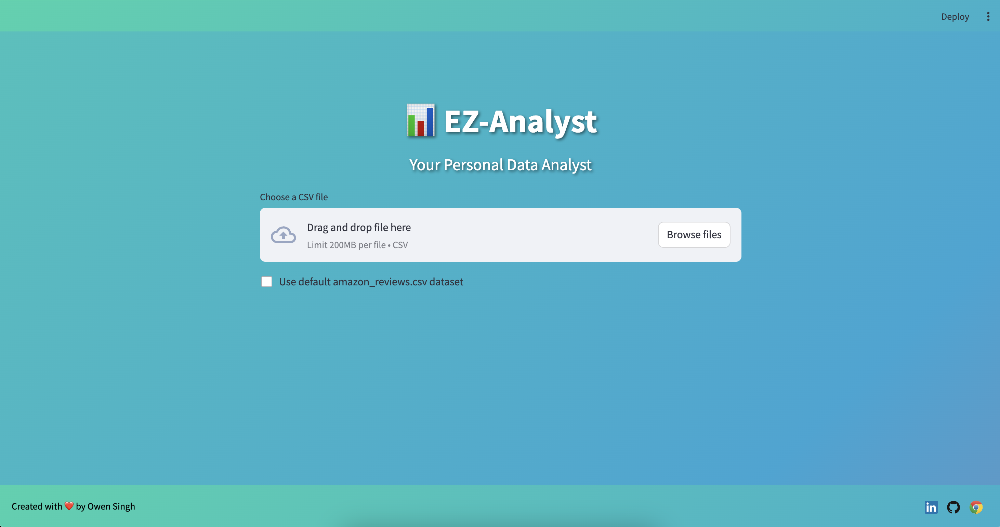

# EZ-Analyst: Automated EDA and Data Analysis App



EZ-Analyst is a Streamlit-based application that streamlines the process of exploratory data analysis (EDA) and automates data analysis tasks. With its user-friendly interface and powerful features, EZ-Analyst makes it easy for data analysts and enthusiasts to gain insights from their datasets quickly. The tool also leverages Open-AI to improve data analysis and generate code and reports easily.

## Features

### 1. Data Exploration

- 📋 **Dataset Preview**: Get a quick overview of your dataset by displaying a specified number of rows.
- 📊 **Dataset Overview**: View the number of rows, columns, and duplicates in your dataset.
- 🕳️ **Missing Values**: Identify and summarize missing values in each column.
- 📈 **Data Statistics and Visualization**:
  - 🔢 Summary statistics for numerical columns
  - 📊 Statistics and value counts for categorical columns
- 📋 **Data Types**: Explore the data types of each column and filter columns by data type.
- 📊 **Individual Feature Distribution**: Analyze the distribution of individual numerical features using histogram, box plot, or KDE plot.
- 📈 **Scatter Plot**: Visualize the relationship between two numerical features.
- 📊 **Categorical Variable Analysis**: Analyze categorical variables using bar charts or pie charts.
- 🔍 **Feature Exploration**: Explore relationships between multiple numerical features using scatter plot matrix, pair plot, and correlation heatmap.
- 📊 **Categorical and Numerical Variable Analysis**: Analyze the relationship between a categorical and numerical variable using box plots.

### 2. Data Preprocessing

- 🗑️ **Remove Unwanted Columns**: Easily remove unwanted columns from your dataset.
- 🕳️ **Handle Missing Data**: Choose from various methods to handle missing data, such as removing rows or filling with mean, median, or mode.
- 📊 **Encode Categorical Data**: Apply one-hot encoding or label encoding to categorical columns.
- 📈 **Feature Scaling**: Scale numerical features using standardization or normalization techniques.
- 📊 **Identify and Handle Outliers**: Detect outliers in numerical columns and choose to remove them or replace them with the median value.
- 📥 **Download Preprocessed Data**: Download the preprocessed dataset as a CSV file.

### 3. Auto Analysis (BETA)

- 📊 **CSV Analysis**: Get recommendations and analysis based on your CSV file, including suggested visualizations, statistical tests, and insights.
- 🤖 **Perform Auto Analysis**: Generate auto analysis code and summary based on your dataset using OpenAI's language model.
  - Generate auto analysis code that performs a complete analysis, including importing required libraries, creating plots, and providing explanations.
  - Generate a detailed summary and analysis of the auto-generated code, explaining the generated graphs and providing insights as a full story analysis.
  - Download the auto analysis code and summary as PDF reports.

## Usage

1. Clone the repository:
   ```
   git clone https://github.com/itsOwen/EZ-Analyst.git
   ```

2. Set your OpenAI API key in the `auto_analysis.py` file:
   ```python
   openai.api_key = "YOUR_API_KEY"
   ```

3. Run the Streamlit app:
   ```
   streamlit run main.py
   ```

4. Access the app in your web browser at `http://localhost:8501`.

5. Upload your CSV file or use the default "amazon_reviews.csv" dataset.

6. Explore the various features of the app, including data exploration, data preprocessing, and auto analysis.

## Dependencies

- Streamlit
- Pandas
- Matplotlib
- Seaborn
- Scikit-learn
- OpenAI
- FPDF

## Contributing

Contributions are welcome! If you have any ideas, suggestions, or bug reports, please open an issue or submit a pull request.

## License

This project is licensed under the [MIT License](LICENSE).

## Contact

For any questions or inquiries, please contact [Owen Singh](mailto:owensingh72@gmail.com).

---

Feel free to customize the README file based on your specific project details and add any additional sections or information as needed.